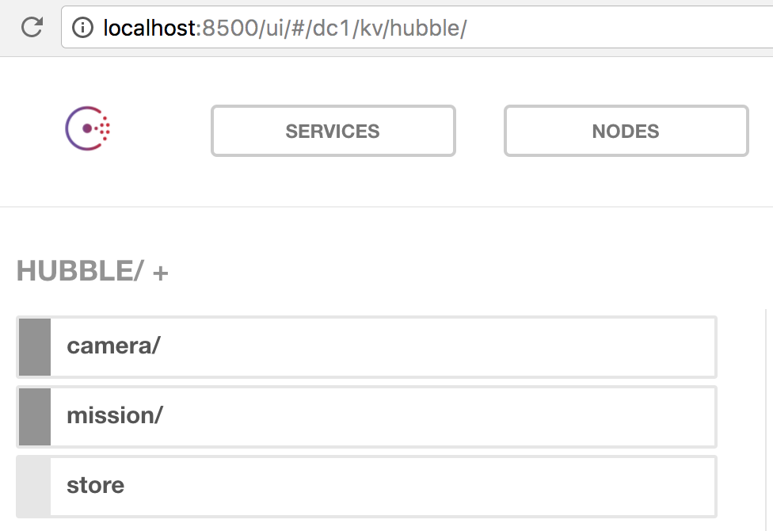

# attaché
[](https://godoc.org/github.com/tolitius/attache)

is a younger brother of [envoy](https://github.com/tolitius/envoy) and it makes a bridge between Consul and application data structures a little more beautiful.

- [How to play](#how-to-play)
- [Map to Consul](#map-to-consul)
- [Consul to Map](#consul-to-map)
- [Options](#options)
- [License](#license)

## How to play

In order to follow all the docs below, bring attaché in:

```go
go get github.com/tolitius/attache
```

## Map to Consul

```go
attache.MapToConsul(consulapi.DefaultConfig(), configMap)
```

takes a consul config and a configMap, which is a `map[string]string`,
and inserts all the {key, value} pairs into Consul.

For exampe let's say we have a `configMap` Go map:

```go
{"hubble/store": "spacecraft://tape"
 "hubble/camera/mode": "color"
 "hubble/mission/target": "Horsehead Nebula"}
```

attaché could write all these entries into Consul respecting `/` hierarchy:

```go
attache.MapToConsul(consulapi.DefaultConfig(), configMap)
```

will bring Hubble "online" preserving config's hierarchy:

<p align="center"></p>

and you can see the Consul log confirming it:

```log
2017/10/18 15:21:53 [DEBUG] http: Request PUT /v1/kv/hubble/store (367.261µs) from=127.0.0.1:59376
2017/10/18 15:21:53 [DEBUG] http: Request PUT /v1/kv/hubble/camera/mode (278.666µs) from=127.0.0.1:59376
2017/10/18 15:21:53 [DEBUG] http: Request PUT /v1/kv/hubble/mission/target (361.468µs) from=127.0.0.1:59376
```

## Consul to Map

```go
attache.ConsulToMap(consulapi.DefaultConfig(), pathOffset)
```

returns a `map[string]string` of all the `k/v` under the `pathOffset`.

For exampe let's say we have this structure in Consul at `localhost:8500`:

```json
{"hubble":
    {"store": "spacecraft://tape",
     "camera":
        {"mode": "color"},
     "mission":
        {"target": "Horsehead Nebula"}}}
```

attaché could read it all into a Go map by:

```go

config := consulapi.DefaultConfig()
config.Address = "localhost:8500"

attache.ConsulToMap(config, "/hubble")
```

which would produce a Go map:

```go
{"hubble/store": "spacecraft://tape"
 "hubble/camera/mode": "color"
 "hubble/mission/target": "Horsehead Nebula"}
```

where keys and values are `string`s

It will do that by calling Consul once (i.e. one GET), starting from the path offset we provided (`"/hubble"`):

```log
2017/10/18 15:21:53 [DEBUG] http: Request GET /v1/kv/hubble?recurse= (214.843µs) from=127.0.0.1:59378
```

## Options

attache relies on the official [Consul API](https://godoc.org/github.com/hashicorp/consul/api) and all attache functions take
[consul/api.Config](https://godoc.org/github.com/hashicorp/consul/api#Config), hence any of its options can be set either via ENV variables
or by overriding the config:

```go
consulConfig := consulapi.DefaultconsulConfig()
consulConfig.Address = "localhost:8500"
consulConfig.Datacenter = "fn42-datacenter"
consulConfig.Token = "7a0f3b39-8871-e16e-2101-c1b30a911883"

appConfig := attache.ConsulToMap(consulConfig, "/hubble")
```

## License

Copyright © 2017 tolitius

Distributed under the Eclipse Public License either version 1.0 or (at your option) any later version.
